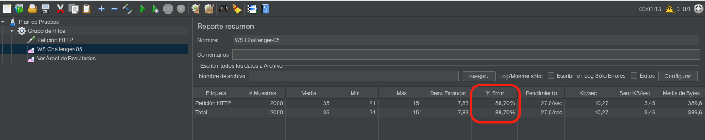
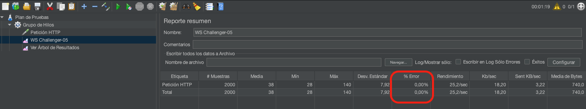
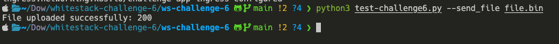
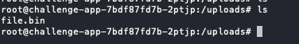
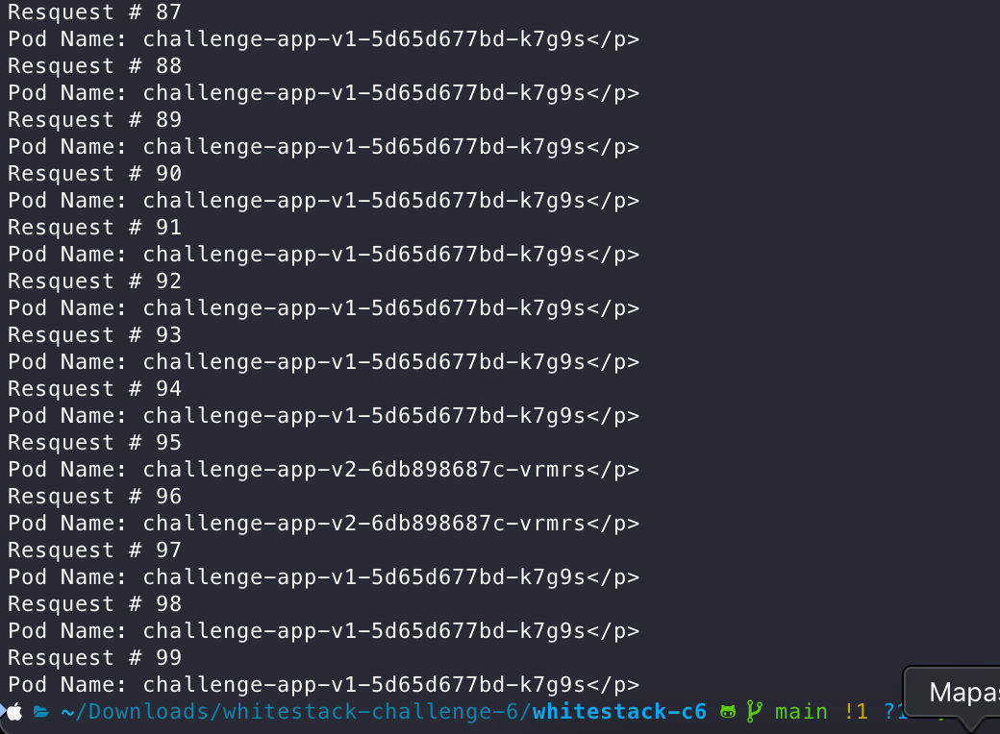
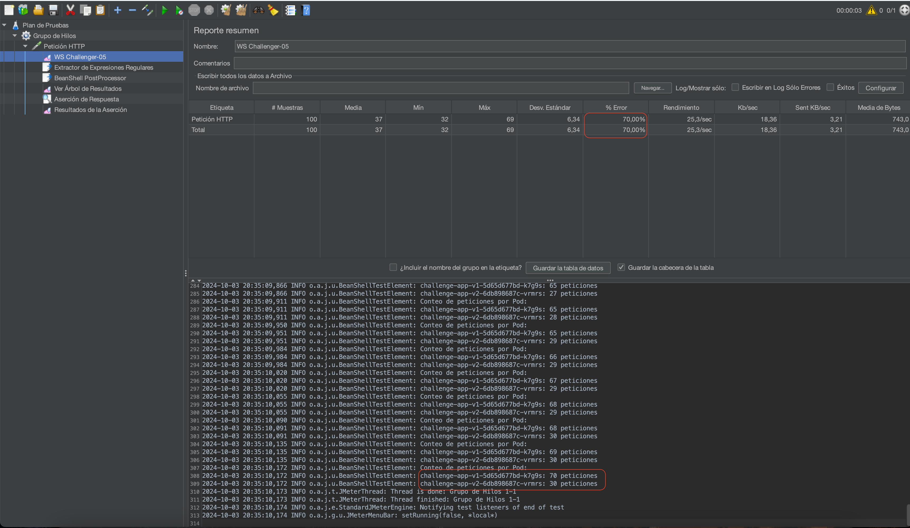

# Whitestack Challenge #6

## Descripción

Este repositorio contiene la solución al **Whitestack Challenge #6**. El objetivo principal es probar el uso de **Ingress Controller** con **ingress-nginx** en Kubernetes para optimizar el acceso a aplicaciones y resolver los desafíos específicos relacionados con balanceo de carga, manejo de solicitudes con headers grandes, alta carga de requests, y manejo de uploads.

## Desafíos Resueltos

A continuación, se detallan cada uno de los pasos seguidos para resolver los desafíos propuestos.

### Desplegar la aplicación

**Objetivo**: Exponer una aplicación a través de un Ingress y validar que esté funcionando correctamente, en base al repositorio repositorio de Whitestack

- Se definió el hostname `ws-challenger-05.dafonim.com` para la URL de la aplicación.
- Se modificó el archivo `ingress.yaml` y se asignó un hostname utilizando una variable de entorno `INGRESS_HOSTNAME`.
- Los manifests `deployment.yaml` e `ingress.yaml` fueron desplegados para exponer la aplicación.
- **Validación**: Se accedió a la aplicación a través de un navegador y mediante comandos `curl`.

**Consideraciones**: 

Para el primer desafío, **Enviar alta carga de requests**, se utilizaron dos entornos: el proporcionado por Whitestack y un entorno local. Esto se debió a que el entorno de Whitestack tiene restricciones para desplegar herramientas externas como `LOKI` y `KEDA`, las cuales, según el análisis y propuesta, fueron necesarias para completar el desafío de manera efectiva.

Para los desafíos restantes, se utilizó completamente el entorno proporcionado por Whitestack.

### 1. Enviar alta carga de requests

**Objetivo**: Probar cómo la aplicación maneja una alta carga de solicitudes y evitar que el pod de la aplicación se reinicie.

Para este desafio se plantearon dos soluciones:

1. Ajustar el limite de RPS (requests per second) en el manifiesto del ingress.
```yaml
nginx.ingress.kubernetes.io/limit-rps: "3"
nginx.ingress.kubernetes.io/limit-burst-multiplier: "1"
```
Permite restringir un máximo de solicitudes por segundo desde una IP específica antes de que ingress comience a limitar el tráfico.
Para conocer el valor óptimo, se utilizó la herramienta `JMETER` para medir la tasa de error, de modo que el valor aplicado mantenga la tasa de error más baja posible sin reiniciar el pod.



Como resultado, se determinó que el valor del RPS debe ser 3. Con este valor, el pod no se reinicia y la tasa de error se mantiene en un 88.7%. Si no se restringe el RPS, el pod se reinicia 3 veces y la tasa de error se reduce a un 60%. Esto considerándose un solo pod.

Otra prueba relevante, que resultó ser la más eficiente en términos de porcentaje de error y reinicios de pod, fue escalar el pod a 10 instancias sin límites de requests en el Ingress. Con esta configuración, se obtuvieron cero reinicios y una tasa de error del 0%.



Los resultados detallados de las pruebas están disponibles en el documento word adjunto.

2. Utilizar Horizontal Pod Autoscaling para escalar el pod automáticamente en base a eventos de carga.

Otra alternativa analizada fue utilizar un HPA basado en eventos, específicamente `KEDA (Kubernetes Event-Driven Autoscaler)`. Para esto, se empleó el scaler `LOKI`, que permite escalar en función del resultado de una consulta en los logs del pod. Esto permitió que el pod escalara automáticamente cuando los logs detectaban "Rate limit exceeded", reduciendo así la tasa de error. Sin embargo, esto requiere el reinicio del pod. A pesar de este inconveniente, es la mejor opción en términos de reducción de la tasa de error.

```yaml
apiVersion: keda.sh/v1alpha1
kind: ScaledObject
metadata:
  name: challenge-app-scaler
  namespace: challenger-05
spec:
  scaleTargetRef:
    kind: Deployment
    name: challenge-app          
  minReplicaCount: 1
  maxReplicaCount: 10
  triggers:
  - type: loki                   
    metadata:
      serverAddress: http://loki.observability-pro:3100
      query: |
        sum(rate({app="challenge-app"} |= "Rate limit exceeded" [30s])) by (app)
      threshold: "0.01"           
```

### 2. Enviar large header requests

**Objetivo**: Simular solicitudes con headers grandes y solucionar el error “502 Bad Gateway”.

Al enviar una solicitud con encabezados grandes, se recibió un error "502 Bad Gateway". La causa de este error fue que los encabezados de la solicitud eran demasiado grandes para ser manejados por el Ingress NGINX. La solución consistió en modificar el archivo ingress.yaml para aumentar el tamaño permitido de los encabezados mediante el uso de las anotaciones correspondientes.

Analizando la respuesta del script `python3 test-challenge6.py --send_simple_request` se pudo observar que el error se debía a que los encabezados de la solicitud eran demasiado grandes para ser manejados por el Ingress NGINX.

```yaml
nginx.ingress.kubernetes.io/proxy-buffer-size: "16k"
nginx.ingress.kubernetes.io/proxy-buffers-number: "8"
nginx.ingress.kubernetes.io/proxy-busy-buffers-size: "64k"
```

- proxy-buffer-size: "16k": Define el tamaño del buffer para almacenar respuestas temporales del backend.
- proxy-buffers-number: "8": Establece cuántos buffers están disponibles para manejar datos simultáneamente.
- proxy-busy-buffers-size: "64k": Determina el tamaño total de buffers en uso cuando las respuestas aún están siendo enviadas al cliente.

### 3. Enviar large header requests

**Objetivo**: Subir un archivo a la aplicación y solucionar el error “413 Request Entity Too Large”.

Durante la prueba de subida de archivos utilizando el script test_challenge6.py con el argumento --send_file, se encontró el error "413 Request Entity Too Large". Esto se debía a que el tamaño del archivo excedía el límite permitido por el Ingress NGINX. La solución fue aumentar el tamaño máximo permitido para las subidas, añadiendo la anotación correspondiente al archivo ingress.yaml.

```yaml
nginx.ingress.kubernetes.io/proxy-body-size: "20m"
```
Resultado:

Posterior a la modificación del archivo ingress.yaml, se pudo subir el archivo a la aplicación utilizando el script test_challenge6.py con el argumento --send_file.


Para validar que el archivo se subió correctamtente, se ingresó al pod por medio de kubectl y se pudo ver el archivo en la ruta `/uploads/`.



### 4. Balancear la carga de los requests

**Objetivo**: Balancear el tráfico entre dos versiones de la aplicación (v1 y v2), asignando un 30% de las solicitudes a la versión v2.

Para resolver este desafío, se utilizó la característica de ingress-nginx llamada canary, que permite distribuir la carga de manera basada en los valores de canary-weight. En este caso, se configuró para dirigir un 30% del tráfico a la versión 2 de la aplicación y un 70% a la versión 1. Para configurar esto, fue necesario desplegar ambas versiones de la aplicación junto con sus respectivos servicios, además de crear dos Ingress con el mismo host, habilitando canary en el Ingress de la versión 2. Los manifiestos necesarios para completar este desafío se encuentran en la carpeta LOAD_BALANCE.

```yaml
apiVersion: networking.k8s.io/v1
kind: Ingress
metadata:
  name: challenge-app-v2-ingress
  namespace: challenger-05
  annotations:
    nginx.ingress.kubernetes.io/rewrite-target: /
    nginx.ingress.kubernetes.io/canary: "true"
    nginx.ingress.kubernetes.io/canary-weight: "30"
spec:
  ingressClassName: nginx
  rules:
  # Change the hostname to a unique value
  - host: ws-challenger-05.dafonim.com
    http:
      paths:
      - path: /
        pathType: Prefix
        backend:
          service:
            name: app-service-v2
            port:
              number: 80
```

Validación:

Utilizando el script test_challenge6.py con el argumento --send_simple_request, se pudo observar que el tráfico se distribuyó entre las dos versiones de la aplicación, con un 30% de solicitudes enviadas a la versión 2.



También se utilizó la herramienta `JMETER` para leer la respuesta de cada petición y validar que se distribuyó el tráfico correctamente.



## Conclusiónes

- Para el desafío de "enviar alta carga de requests", la opción más clara inicialmente fue incrementar el límite de requests por segundo en el Ingress. Sin embargo, tras analizar la tasa de errores que esto ocasionaba, se optó por utilizar herramientas de escalado basadas en eventos, en este caso los logs, como KEDA. Aunque esta opción conlleva algunos reinicios, la tasa de error se reduce significativamente.
- El entorno proporcionado por Whitestack tiene restricciones de acceso, por lo que el desafío "enviar alta carga de requests" se llevó a cabo en un entorno local. Esto permitió la instalación de LOKI y KEDA.
- Basándonos en el script proporcionado por Whitestack, test_challenge6.py, se decidió utilizar la herramienta JMETER para analizar los resultados. Esto permitió evaluar métricas como la tasa de error y, en el desafío 4, asegurarnos de que el tráfico se distribuyera correctamente entre las dos versiones de la aplicación.
